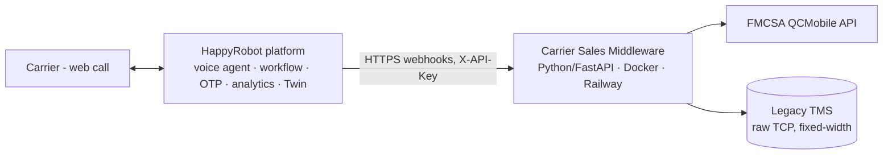

# Inbound Carrier Sales Automation — HappyRobot FDE Challenge

An AI voice agent that automates the first leg of a freight brokerage's inbound
carrier desk: it verifies the carrier, confirms their identity, finds a matching
load, negotiates the rate, books it, and hands off to a senior rep — logging every
call for analytics. Built on the HappyRobot platform + a custom integration
service.

> **Status:** Live and validated end-to-end with real calls (real FMCSA lookups,
> real TMS bookings, every call logged to a Twin database).

## Deliverables

| Deliverable | Link |
| --- | --- |
| Summary email (prospect) | [`second/SUMMARY_EMAIL.md`](second/SUMMARY_EMAIL.md) |
| Build description (IT + business) | [`second/BUILD_DESCRIPTION.md`](second/BUILD_DESCRIPTION.md) |
| Code repository | _this repo_ |
| HappyRobot workflow | _[workflow link]_ |
| Walkthrough video (~5 min) | _[video link]_ |
| Operational UI (HappyRobot App) | https://platform.happyrobot.ai/fderobertoarce/apps/carrier-call-app-35v50 |
| Live middleware | https://happyrobottest-production.up.railway.app |

## Architecture



The **middleware** is the integration layer: it translates the platform's clean
REST/JSON calls into the legacy TMS's raw fixed-width TCP protocol (handling its
injected timeouts and malformed responses) and into FMCSA REST lookups. The
platform cannot speak that protocol directly — hence the adapter.

## Call flow

```
verify MC (FMCSA) → OTP → search loads → pitch → negotiate (≤3 rounds, ceiling
hidden) → book → mocked senior-rep handoff → log to Twin
```

## Repository layout

```
second/
  inbound-carrier-sales/   Python middleware (FastAPI)
    app/                   TCP adapter, FMCSA, OTP, negotiation, REST API
    tests/                 17 tests incl. fault-injection fake TMS
    scripts/               TMS/FMCSA exploration probes
    Dockerfile, railway.toml
  platform/                TypeScript SDK scaffold (Northstars, adversarial, workflows)
  BUILD_DESCRIPTION.md     Full build doc (architecture, security, QA, KPIs)
  SUMMARY_EMAIL.md         Prospect summary email
```

## Run the middleware locally

```bash
cd second/inbound-carrier-sales
cp .env.example .env          # fill TMS_*, FMCSA_WEB_KEY, API_KEY
pip install -r requirements.txt
python -m pytest              # 17 tests, incl. all documented TMS fault modes
uvicorn app.main:app --reload
# or: docker build -t carrier-sales . && docker run --env-file .env -p 8000:8000 carrier-sales
```

## Design highlights

- **Fault-tolerant TMS adapter** — one connection per request, reads to the `END`
  terminator, retries transport faults with backoff, never retries semantic
  errors (no double-booking).
- **Rate ceiling never leaves the server** — the LLM only sees accept/counter/reject,
  so it cannot disclose the maximum under any pressure.
- **OTP isolated from the agent** — code generated server-side, never in the
  agent's context; resists social-engineering bypass.
- **One MC verification per call** — prevents credential "fishing."

## QA

- **17 unit tests** against a fake TMS reproducing every documented fault mode.
- **Adversarial suite** (auto-graded against 9 Northstar criteria) + manual
  red-team calls. Two real weaknesses surfaced and were fixed and re-verified
  (accepting a second MC after a fail; getting stuck without advancing the flow);
  the security-critical behaviors held throughout. See
  [`second/BUILD_DESCRIPTION.md`](second/BUILD_DESCRIPTION.md) §8.

## Production notes

- **SMS OTP delivery** needs a provisioned sender (Admin-gated on the trial org);
  the OTP logic is complete and the code is read from the run log for the POC.
- Lead with **Negotiation Savings** (carrier's opening ask − agreed) as the value
  metric; `computed_margin` (listed − agreed) is negative when a deal closes above
  the listed rate but under the hidden ceiling — expected behavior.
