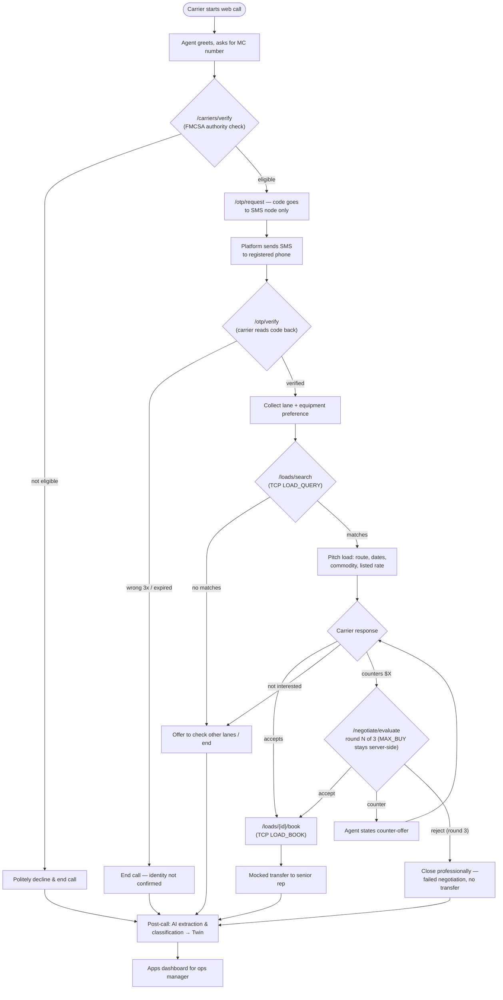
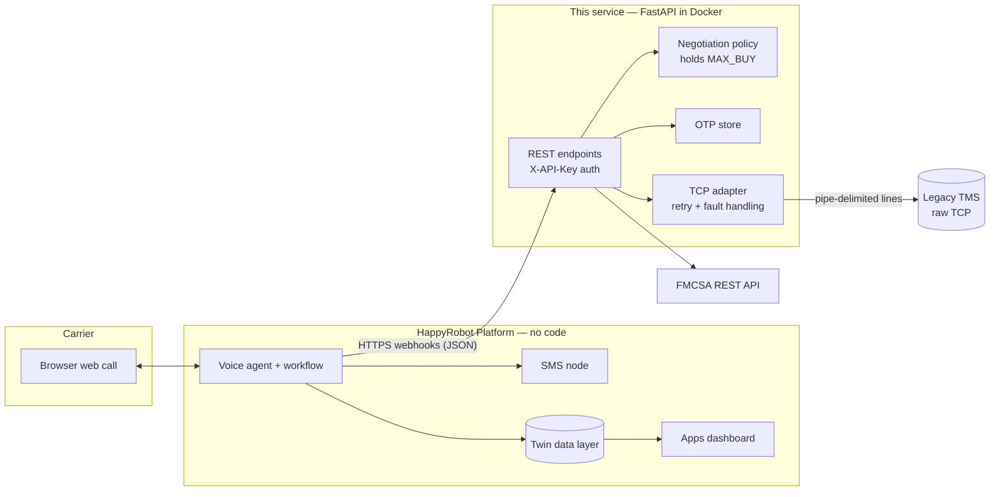

# Inbound Carrier Sales — Middleware

REST facade between the HappyRobot voice workflow and:

- the **Legacy TMS** (raw TCP, fixed-width line protocol, fault-injecting),
- the **FMCSA** carrier verification API,
- the **OTP** identity-confirmation flow,
- the server-side **negotiation policy** (MAX_BUY never leaves this service).

## Run locally

```bash
pip install -r requirements.txt
cp .env.example .env   # fill in values
uvicorn app.main:app --reload
```

## Tests

```bash
python -m pytest
```

The suite spins up a local fake TMS that reproduces all documented fault
modes (timeout, partial response, malformed frame, delayed close) and
verifies the adapter retries transport faults but never retries semantic
errors (AUTH_FAILED, UNKNOWN_LOAD, ALREADY_BOOKED, INVALID_RATE...).

## Docker

```bash
docker build -t carrier-sales .
docker run --env-file .env -p 8000:8000 carrier-sales
```

## Endpoints (all require `X-API-Key`)

| Method | Path                  | Purpose                                   |
| ------ | --------------------- | ----------------------------------------- |
| GET    | /healthz              | Liveness (unauthenticated)                |
| GET    | /tms/ping             | DEBUG_ECHO connectivity check             |
| POST   | /carriers/verify      | FMCSA authority check by MC number        |
| POST   | /otp/request          | Issue OTP (code goes to SMS node only)    |
| POST   | /otp/verify           | Verify OTP (3 attempts, 5 min TTL)        |
| POST   | /loads/search         | LOAD_QUERY → JSON                         |
| GET    | /loads/{id}           | LOAD_GET → JSON (MAX_BUY stripped)        |
| POST   | /loads/{id}/book      | LOAD_BOOK                                 |
| POST   | /negotiate/evaluate   | accept / counter / reject (3-round cap)   |

## Call flow



## Architecture



## Security design

- The voice agent never receives `MAX_BUY`: negotiation decisions are made
  server-side, so the LLM cannot be social-engineered into revealing the
  ceiling.
- The OTP code is returned only to the workflow's SMS-send node and is never
  placed in the agent's conversational context.
- One TCP connection per TMS request per spec; retries with exponential
  backoff on transport faults only.
